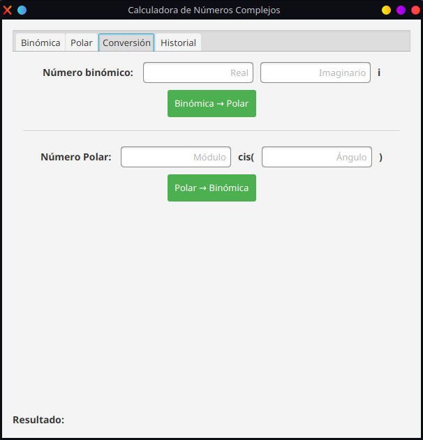

# Complex Number Calculator
## Descripción del Proyecto
Esta es una calculadora de números complejos desarrollada en JavaFX que permite realizar operaciones tanto en forma binómica como polar, incluyendo conversiones entre ambas representaciones.

## Características
### Operaciones Binómicas

- Suma de números complejos
- Resta de números complejos
- Multiplicación de números complejos
- División de números complejos

### Operaciones Polares

- Multiplicación de números complejos
- División de números complejos
- Cálculo de potencias
- Cálculo de raíces

### Funcionalidades Adicionales

- Conversión entre formas binómica y polar
- Historial de operaciones
- Interfaz gráfica intuitiva

## Requisitos del Sistema

- Java 21 o superior
- JavaFX 17.0.6
- Maven

## Dependencias
El proyecto utiliza las siguientes bibliotecas:

- JavaFX Controls
- JavaFX FXML
- ControlsFX
- FormsFX
- ValidatorFX
- Ikonli
- BootstrapFX

## Instalación

1. Clonar el repositorio:

``` sh
git clone https://github.com/tu-usuario/complex-calculator.git
```

2. Navegar al directorio del proyecto:

``` bash
cd complex-calculator
```

3. Compilar el proyecto con Maven:

```bash
mvn clean install
```

## Ejecución
Ejecutar la aplicación con Maven:
```bash
mvn javafx:run
```

## IDE
En caso de usar algún IDE, se ejecutará la clase `ComplexCalculatorApp`, donde automáticamente comenzará a instalar las dependencias y ejecutará el programa.

## Uso
### Pestaña Binómica

<center>

</center>

1. Introduce los números complejos en las casillas de parte real e imaginaria
2. Selecciona la operación deseada
3. Haz clic en "Calcular"

### Pestaña Polar

<center>

</center>

1. Introduce los números complejos en módulo y ángulo
2. Selecciona la operación deseada
3. Para potencias y raíces, introduce el exponente o índice
4. Haz clic en "Calcular"

### Pestaña de Conversión

<center>

</center>

- Convierte entre representaciones binómica y polar

### Pestaña de Historial

<center>

</center>

- Visualiza todas las operaciones realizadas
- Limpia el historial con el botón "Limpiar Historial"

## Estructura del Proyecto
```
src/
├── main/
│   ├── java/
│   │   └── com/
│   │       └── complexcalculator/
│   │           └── complexcalculator/
│   │               ├── ComplexCalculatorApp.java
│   │               ├── ComplexCalculatorController.java
│   │               └── complex/
│   │                   └── number/
│   │                       ├── Binomic.java
│   │                       └── Polar.java
│   └── resources/
|       └── com/
|           └── complexcalculator/
|               └── complexcalculator/
│                   ├── complex-calculator.fxml
│                   └── styles/
│                       └── styles.css
└── test/
    └── java/
        └── com/
            └── complexcalculator/
	            └── complexcalculator/
```
## Contribuciones
Las contribuciones son bienvenidas. Por favor, sigue estos pasos:

1. Haz un fork del proyecto
2. Crea tu rama de características (`git checkout -b feature/AmazingFeature`)
3. Confirma tus cambios (`git commit -m 'Add some AmazingFeature'`)
4. Sube tu rama (`git push origin feature/AmazingFeature`)
5. Abre una solicitud de extracción

## Licencia
Distribuido bajo la Licencia MIT. Consulte [LICENSE](LICENSE) para más información.
## Contacto
Autor: Jhon Alexander Gómez Trujillo

Repositorio del autor: https://github.com/JAGT1806

Enlace del Proyecto: https://github.com/JAGT1806/complex-calculator